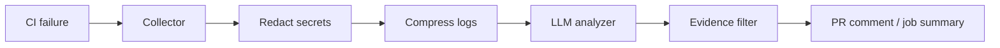

# CI Autopsy

**Evidence-backed CI failure reports for GitHub Actions.**

When a job goes red, CI Autopsy compresses the noisy logs, redacts secrets, asks an LLM for a structured diagnosis, **verifies every evidence quote appears in the real log/diff**, and posts (or updates) a single PR comment.

This is a weekend-scoped portfolio project: installable Action + local CLI + fixture demos — not a multi-tenant SaaS.

## Quick start

Add a final step to a job (or a dedicated failure observer):

```yaml
permissions:
  contents: read
  pull-requests: write

jobs:
  test:
    runs-on: ubuntu-latest
    steps:
      - uses: actions/checkout@v4
      # ... your build/test steps ...
      - name: CI Autopsy
        if: failure()
        uses: ./   # or your-org/ci-autopsy-agent@main after publish
        with:
          llm_api_key: ${{ secrets.LLM_API_KEY }}
          github_token: ${{ secrets.GITHUB_TOKEN }}
```

Build the action entrypoint before use in this monorepo:

```bash
pnpm install
pnpm --filter @ci-autopsy/core build
pnpm --filter @ci-autopsy/action build
```

## Architecture



| Module | Role |
|--------|------|
| `packages/core` | Redact, compress, analyze, evidence check, render, GitHub helpers, pipeline |
| `packages/cli` | `ci-autopsy --log file` for offline demos |
| `packages/action` | GitHub Action entrypoint |
| `demos/failing-node` | Intentional F1–F3 failures |

## Evidence rules

- Max 3 hypotheses per report.
- Each `evidence.quote` must be a **verbatim substring** of the provided log/diff context.
- Fabricated quotes are stripped; if nothing remains, status becomes `insufficient_evidence`.
- Treat patches as suggestions, not auto-applied fixes.

## Security

- Logs are redacted for common secret patterns (tokens, AWS keys, private keys, `api_key=...`) **before** the model call.
- Redaction is best-effort, not a guarantee — do not rely on it as a compliance boundary.
- Log content is sent to the **OpenAI-compatible** endpoint you configure (`llm_base_url` / `LLM_BASE_URL`).

## CLI

```bash
pnpm --filter @ci-autopsy/core build
pnpm --filter @ci-autopsy/cli build
export LLM_API_KEY=sk-...
node packages/cli/dist/main.js --log path/to/ci.log --repo owner/name
```

Optional: `LLM_BASE_URL`, `LLM_MODEL`, `CI_AUTOPSY_STRICT=1`.

## Demo fixtures (`demos/failing-node`)

| ID | Class | Script | Intent |
|----|-------|--------|--------|
| F1 | Dependency | `npm run f1` | Missing module |
| F2 | Compile/type | `npm run f2` | TypeScript type error |
| F3 | Test assertion | `npm run f3` | Failing `node:test` |

## Development

```bash
pnpm install
pnpm test          # core unit tests
pnpm --filter @ci-autopsy/core build
```

## Non-goals (v1)

- Auto-commit / auto-open fix PRs  
- Non-GitHub CI systems  
- SaaS accounts, billing, dashboards  
- Guaranteed correct root cause on every failure  
- Historical failure-pattern memory  

## License

MIT (or your choice when you publish).
